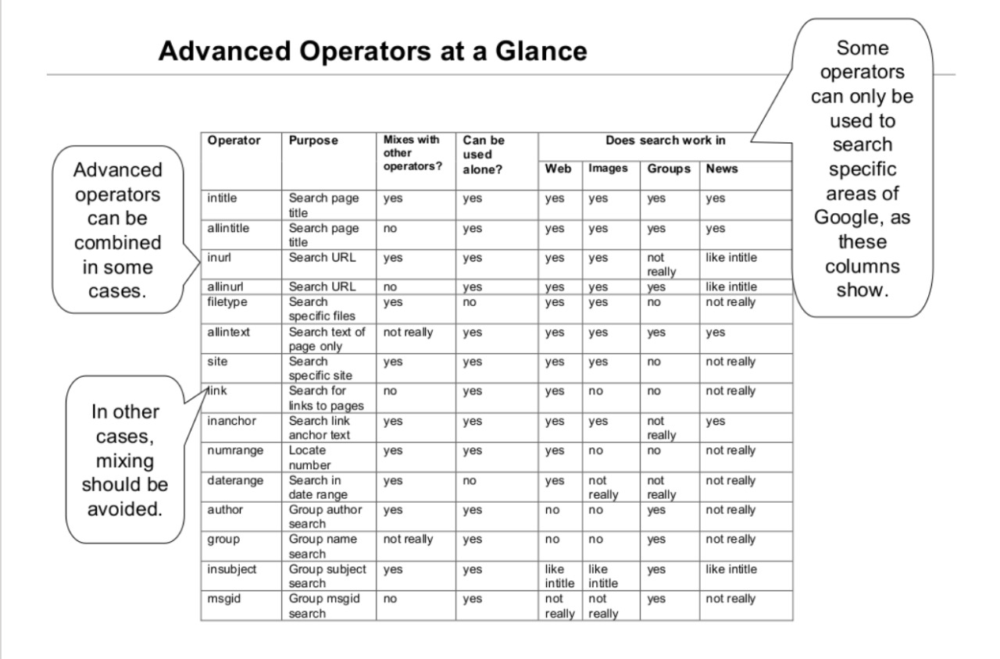

Subdomain Enumeration
	Tools and How to setup up with them & What commands and options works with which one and own review for each of them.

	Tools:
		Sublist3r
			sudo git clone https://github.com/aboul3la/Sublist3r
			cd Sublist3r
			sudo pip install -r requirements.txt

			Notes to install pip
				sudo apt-get install python-pip
				sudo apt-get install python3-pip

			Test whether the tool is working or not
				python Sublist3r.py -d <domain.com>

			//To do: list out more use cases for Sublist3r

			python /opt/tools/Sublist3r/sublist3r.py -d net-square.com

		Subbrute
			already integrated with the Sublist3r

			sudo git clone https://github.com/TheRook/subbrute.git

			to test single domain
				python subbrute.py google.com 
			To test multiple domains
				./subbrute.py google.com gmail.com blogger.com
			to test a newline delimited list of domains
				./subbrute.py -t list.txt

		Google Dorks

			
			eg.
				site:google.com
				site:google.com -www -cloud

		Subfinder
			to use the subfinder on a single domain
				subfinder -d <domain.com>
					-silent
					-o to specify output in some file
				subfinder -d <domain.com> -o output.txt

				subfinder -d hackerone.com -o output.json -oJ -nW
				> cat output.json
					{"host":"www.hackerone.com","ip":"104.16.99.52"}
					{"host":"mta-sts.hackerone.com","ip":"185.199.108.153"}

				can be piped with other tools as well
				echo hackerone.com | subfinder -silent | httpx -silent
				echo hackerone.com | subfinder -v
				cat target.txt | subfinder -v

				//To Do : to setup the api keys for various services

		Knock
			Installing	
				$ git clone https://github.com/guelfoweb/knock.git
				$ cd knock

			Set your virustotal API_KEY:
				$ nano knockpy/config.json

				$ sudo python setup.py install

			Scan with internal wordlist
				knockpy <domain.com>
			Scan with external wordlist
				knockpy domain.com -w wordlist.txt
			Resolve domain name and get response headers
				knockpy -r domain.com [or IP] 
			Save scan output in CSV
				knockpy -c domain.com
			Export full report in JSON
				knockpy -j domain.com

		Masscan

		Amass
			for subdomain enumeration
				amass enum -d example.com

			//To Do : Read the tutorial for the indepth use cases : lots and lots of user cases

		AssetFinder
			installation

			//To Do : installation, setup and demo

	Notes: 
		Always check subdomains for both HTTP and HTTPS while checking which ones are valid.

